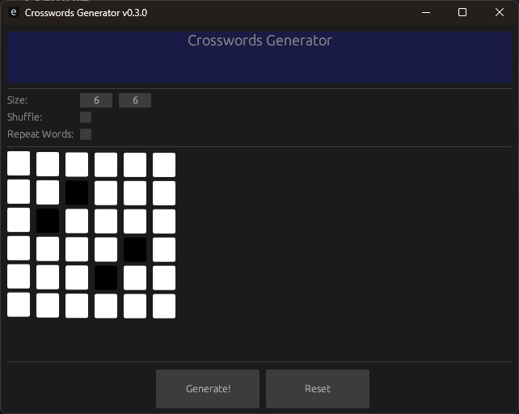
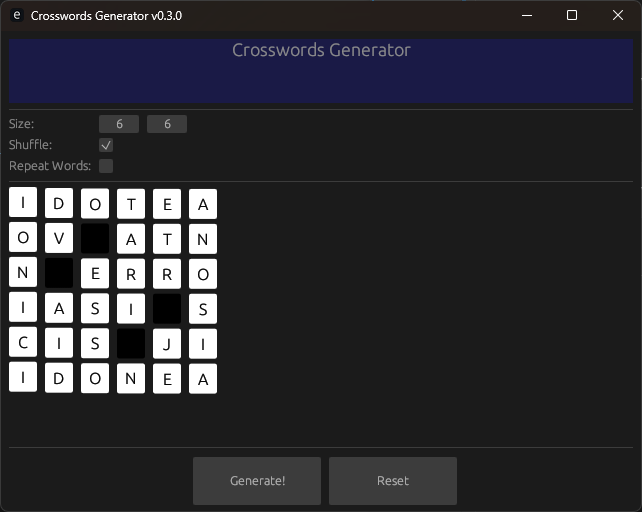
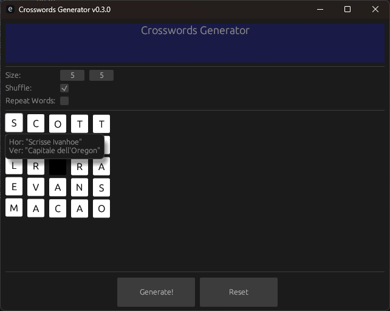
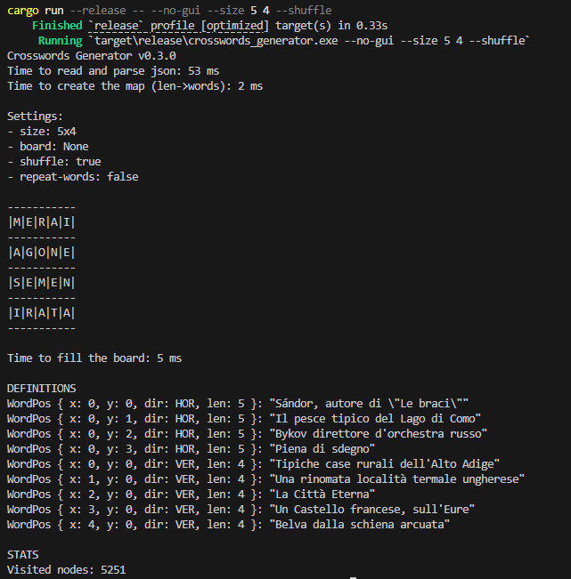

# Crosswords Generator

> **Crosswords Generator** is a tool for generating crosswords puzzles. Choose the size of the board, select which cells are blocked and click Generate! to find a valid solution.


## Table of Contents
- [Crosswords Generator](#crosswords-generator)
  - [Table of Contents](#table-of-contents)
  - [Features](#features)
  - [Getting Started](#getting-started)
    - [Prerequisites](#prerequisites)
    - [Installation](#installation)
  - [Usage](#usage)
  - [Example](#example)
  - [Screenshots](#screenshots)
    - [Main Screen](#main-screen)
    - [Possible Solution](#possible-solution)
    - [Definitions](#definitions)
    - [Ouput of a run without GUI](#ouput-of-a-run-without-gui)

## Features
Fast and simple.

## Getting Started

### Prerequisites
Ensure you have the following installed:
- [Rust](https://www.rust-lang.org/tools/install) (latest stable version recommended)
- [Cargo](https://doc.rust-lang.org/cargo/)

### Installation
Clone the repository:
```bash
git clone https://github.com/EatingLupini/crosswordsgenerator.git
cd crosswordsgenerator
```

Build the project:
```bash
cargo build --release
```

Run with default values:
```bash
cargo run --release -- --no-gui
```

## Usage
Run with GUI
```bash
cargo run --release
```

Run with no GUI
```bash
cargo run --release -- --no-gui --help
```

## Example
Run with GUI
```bash
cargo run --release
```

Run without GUI
```bash
cargo run --release -- --no-gui --help
```

## Screenshots

<details>
<summary>Click to view screenshots</summary>

### Main Screen


### Possible Solution


### Definitions


### Ouput of a run without GUI


</details>
